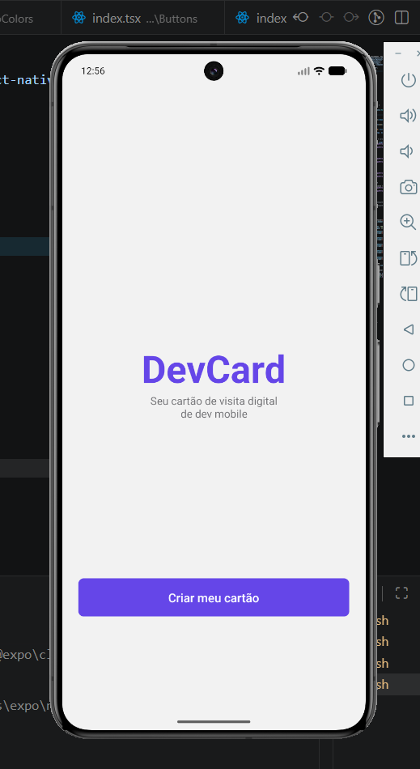
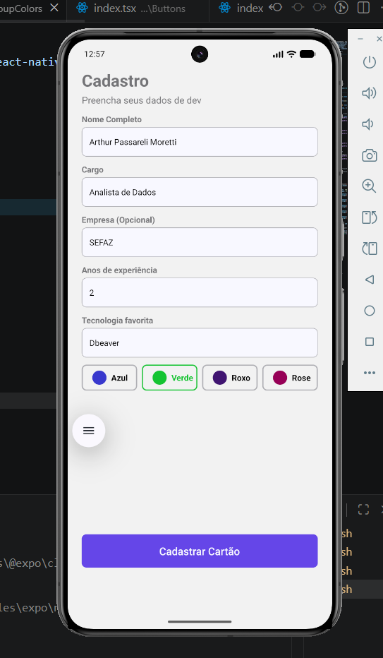
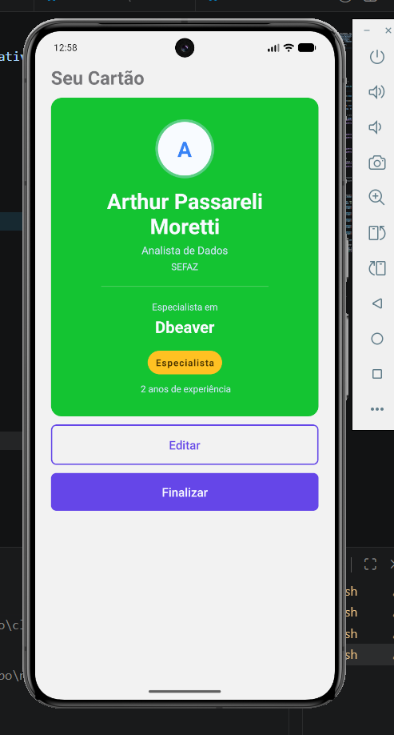
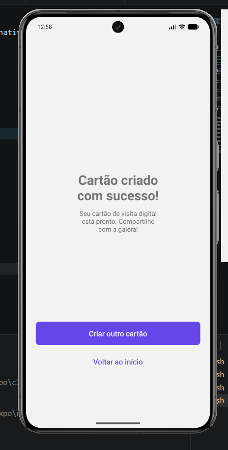

# IA2 DevCard

O que é o projeto e descrição: DevCard é um projeto desenvolvido para a IA2 de Aplicações Móveis. A aplicação permite criar cartões personalizados de desenvolvedor de forma simples e prática, adicionando informações como nome, cargo, empresa, experiência e tecnologia favorita. O projeto possui uma tela inicial, uma tela de cadastro para preenchimento das informações, uma página de preview para visualizar o cartão e uma página de sucesso confirmando a criação do DevCard.

autor: Arthur Passareli

# Print

Print das telas:

